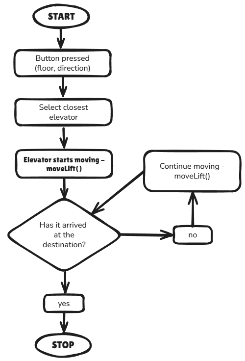

### Introduction

I received this test assignment from the WebGurus team and was excited to start working on it.
In this documentation, I describe in detail how I understood the task, how I approached the problem, and how I implemented the solution step by step.
My goal is to explain the system's logic and my thinking in a clear and understandable way.

---

### 1. Understanding the Task

When I first read the task description, it seemed complex, so I decided to ask ChatGPT for help in order to better understand it.
I approached it as if I were asking a client for more details and clarifications about the requirements.
I believe that before I start coding, it's important to thoroughly understand the problem, so I can avoid going in the wrong direction during implementation.
As the next step, I tried to break the problem into smaller parts and started building a working solution based on that.

---

### 2. System Goal

---

### 5. Diagram – Elevator Logic

The diagram below illustrates the step-by-step logic behind the elevator control system.
Process flow:
The user presses the ⬆️ or ⬇️ button on a specific floor.
The system determines which elevator is closest to the requested floor.
The selected elevator starts moving toward the target floor.
During the movement, the UI is re-rendered continuously.
When the elevator reaches the destination, the animation stops.

---
### 7. Live Demo Link
You can view the working version of the project at the following link:
https://elevator-control-system-galsandor.netlify.app/

